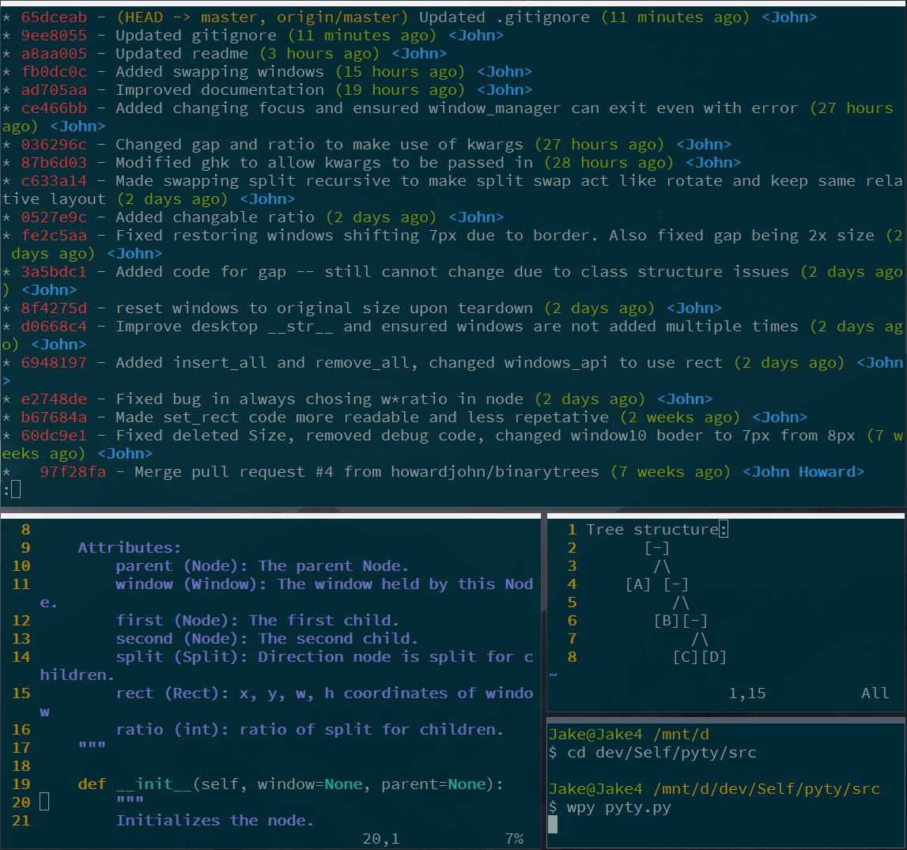

# PyTy
PyTy is a tiling window manager for windows written in python, with heavy usage of the win32api library.

### Goals
PyTy is written to be fully extensible and readable. 
Users are able to modifiy and add to any functions to suit their needs.

### Structure
|Module|Function|
|------|--------|
hook_manager | registers Windows key hooks, which call functions in window_manager.
window_manager | manipulates windows and stores the desktop.
desktop | maintains the window tree and stores the root node.
node | stores info including bounding rect, split direction, split ratio, and its window.
window | stores hwnd reference and api calls to move window.

Windows are stored in a binary tree. All actual windows are leaf nodes of this tree.

Internal nodes simply hold positioning data and split its children in half.
This split is defined by the split (vertical or horizontal) and the ratio of sizes between the windows.

### Example


### Roadmap
- Complete all window_manager functions to allow complete control over windows. (Removal and complex movement)
- Implement different insertion methods.
- Implement settings file.
- Improve compatability with abnormal window types. (especially Metro styles)
- Implement multiple desktop support.
- Override Windows' window manipulation functions.
- Submit to PyPi.

### Requirements
```
namedlist==1.7
pywin32==220.1
```
